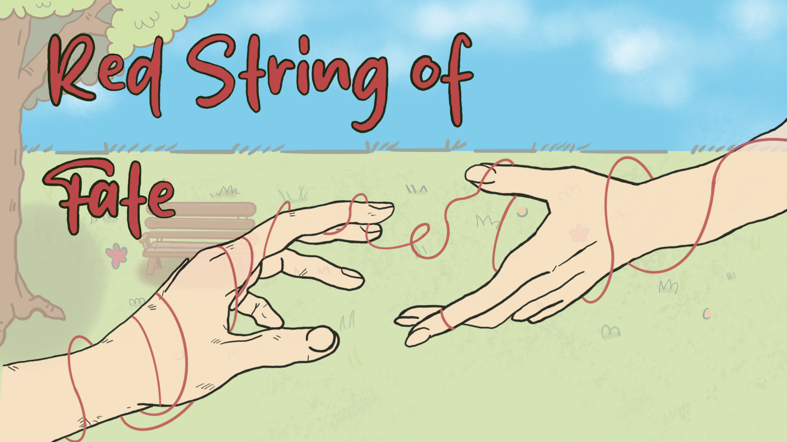

# Red String of Fate



A narrative 2D puzzle-platformer built in Unity. You're tethered to someone by a literal red string of fate — but the string fades the further you travel, and you'll need to solve tangram puzzles along the way to keep your connection alive.

**[Download it on itch.io](https://chibielif.itch.io/red-string-of-fate)**

## Gameplay

- **Follow the string.** A red thread connects you to your fated person and visibly renders between you as you move through the world.
- **Watch it fade.** Every time you pass through a gate into a new area, the string loses visibility. Let it run out and it disappears entirely.
- **Refill it with tangram puzzles.** Certain points along the way open a tangram mini-game — solve it to restore the string to full visibility and keep going.
- **Reach the end.** The story unfolds across a sequence of hand-crafted scenes as you make your way toward reuniting the two ends of the string.

## Controls

| Action | Input |
|---|---|
| Move | WASD / Arrow keys (or gamepad stick) |
| Interact / solve tangram | Mouse |

## Built with

- **Engine:** Unity 6000.3.6f1
- **Render pipeline:** Universal Render Pipeline (URP)
- **Input:** Unity Input System
- **UI/Text:** TextMesh Pro

## Running it locally

1. Clone the repo.
2. Open the project folder with Unity Hub (Unity **6000.3.6f1** or compatible).
3. Open `Assets/Scenes/Main Menu.unity` and hit Play.

## Project structure

```
Assets/
  Scenes/        Main Menu, Settings, and the sequential story scenes (Scene1 → Scene28)
  Scripts/        Core gameplay: player movement, the red string renderer, gates,
                   love-refill triggers, game/menu managers, and the Tangram mini-game
  Sprites/        Art
  Sounds/         Music and SFX (routed through separate Music/SFX audio mixers)
```

## Credits

Designed and developed solo by [Elif](https://github.com/chibielif).
